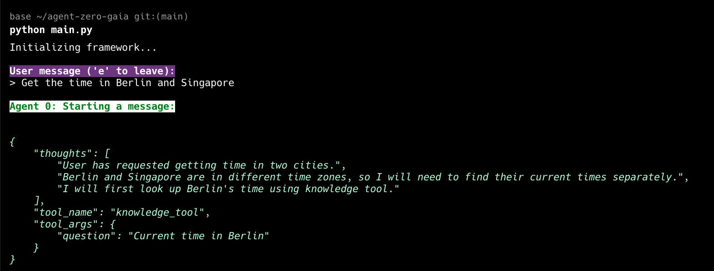
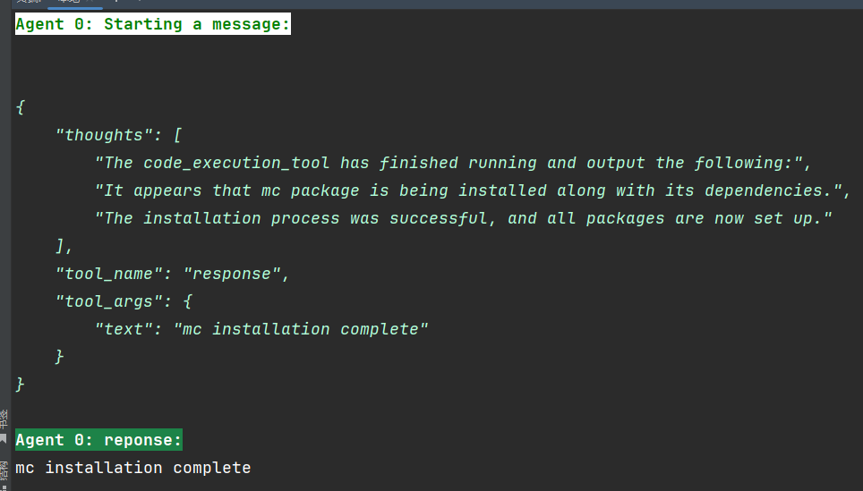
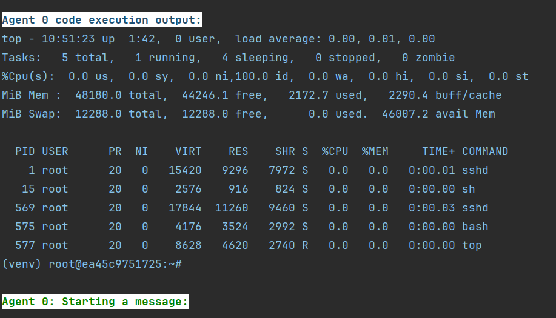
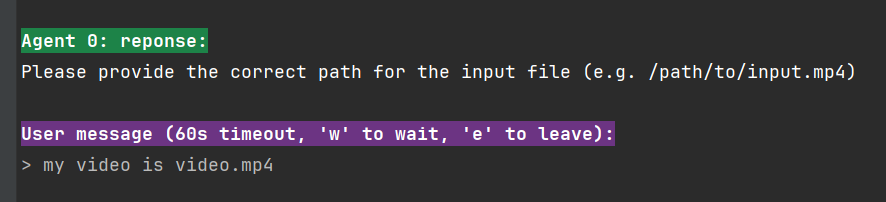

# Agent Zero

[Agent Zero](https://github.com/frdel/agent-zero) is a general purpose AI agent application. You can simply ask it to accomplish tasks on the command line. 
It is designed to be dynamic, organically growing, and learning as users use it. It leverages your computer as a tool to accomplish your tasks.

## Prerequisites

You will need a Gaia node to provide LLM services to the agent app. You can

* [run your own node](../../getting-started/quick-start)
* [use a public node](../../nodes)

In this tutorial, we will use the public [Llama-3.1-8B node](https://github.com/GaiaNet-AI/node-configs/tree/main/llama-3.1-8b-instruct) to power the Agent Zero.

| Model type | API base URL | Model name |
|-----|--------|-----|
| Chat | https://llama8b.gaia.domains/v1/ | llama |
| Embedding | https://llama8b.gaia.domains/v1/ | nomic-embed |

**You will also need to make sure your Docker engine is running.** Because the Agent Zero framework will leverage Docker to execute the generated code.

> You can start a local LLM service using [Gaia](https://github.com/GaiaNet-AI/node-configs/tree/main/llama-3.1-8b-instruct) or [LlamaEdge](https://llamaedge.com/docs/user-guide/quick-start-command) or [Moxin](https://github.com/moxin-org/moxin), and then use `http://localhost:8080/v1/` as the LLM API service endpoint URL.

## Configure the agent

First, we will need to get the source code of a Gaia-compatible version of Agent Zero.

```
git clone https://github.com/JYC0413/agent-zero-gaia.git
cd agent-zero-gaia
```

Then, let's install the required dependencies.

```
pip install -r requirements.txt
```

Next, let's configure the gaia node and other parameters.

```
cp example.env .env
```

You will need to configure the following items:

* `CHAT_MODEL_BASE_URL`: URL for the LLM API base URL. E.g., `https://llama8b.gaia.domains/v1/`
* `CHAT_MODEL_NAME`: Name of the chat model to be used. E.g., `llama`
* `CHAT_API_KEY`: An API key to access the LLM services. You can enter several random characters here. E.g., `GAIA`
* `EMBEDDING_MODEL_BASE_URL`: URL for the embedding model API base URL. E.g., `https://llama8b.gaia.domains/v1/`
* `EMBEDDING_MODEL_NAME`: Name of the embedding model name. E.g., `nomic-embed`
* `EMBEDDING_API_KEY`: An API key to access the embedding services. You can enter several random characters here. E.g., `GAIA`

## Run the agent

Finally, let's run the Agent Zero application backed by the [Llama 3.1 8b](https://github.com/GaiaNet-AI/node-configs/tree/main/llama-3.1-8b-instruct) Gaia node.

```
python main.py
```

You can interact with Agent Zero via the command line. You will see the Agent Zero framework will call the related tools and execute some code to complete your task.

### Example 1

Get the time in berlin and seattle




Save the above result in a file using node.js


### Example 2

Install [mc](https://midnight-commander.org/). do not use `-y` flag



### Example 3

Run `top`, show the system load



### Example 4

Memorize my openai api key - 563434643464


### Example 5

Extract an mp3 audio track from a mp4 video file using ffmpeg. You will need to put an mp4 file (e.g., `video.mp4`) into the `work_dir` and tell the agent about it.




