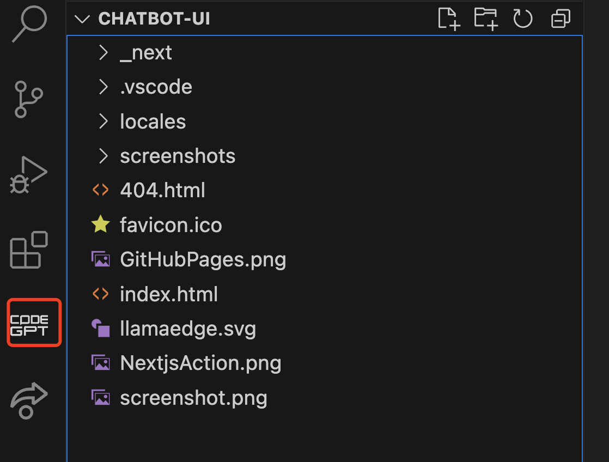
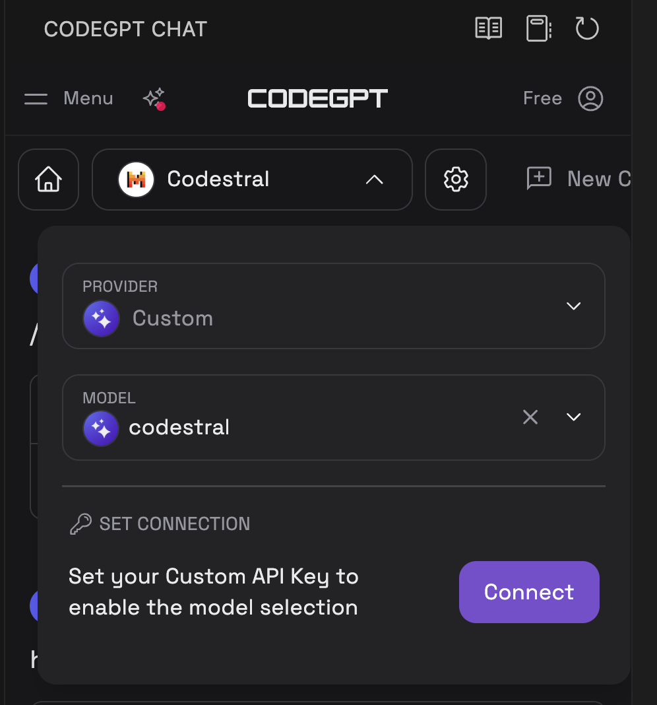
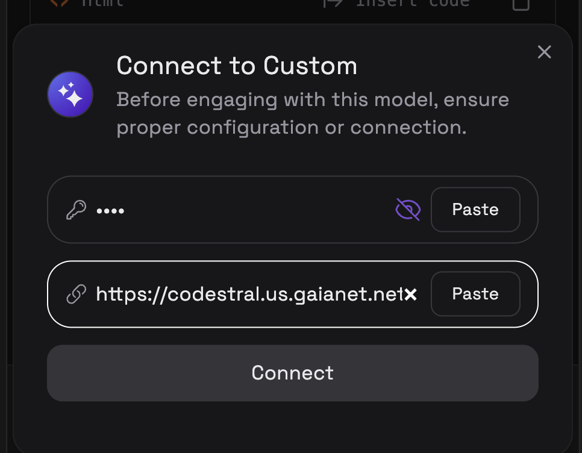
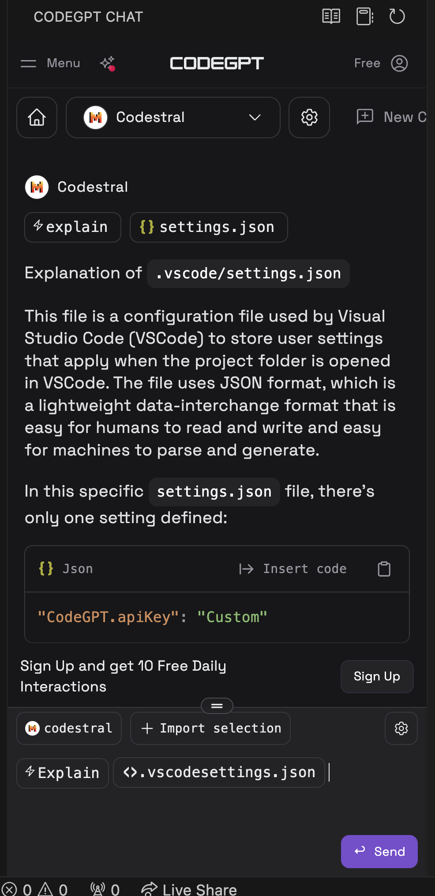

# CodeGPT

CodeGPT is a pair-programming partner for developers. It offers AI chat assistance, auto-completion, code explanation, error-checking, and much more. You can find the CodeGPT extension in VScode and Jetbrains. You can easily configure it to use Gaia nodes as LLM backends.

## Prerequisites

You will need a Gaia node ready to provide LLM services through a public URL. You can

* [run your own node](../../getting-started/quick-start)
* [use a public node](../nodes)

In this tutorial, we will use the public CodeStral nodes to power the CodeGPT plugin.

| Model type | API base URL | Model name |
|-----|--------|-----|
| Chat | https://coder.gaia.domains/v1/v1/ | coder |

> For some reason, CodeGPT requires the API endpoint to include an extra `v1/` at the end.

## Install CodeGPT

Download [the CodeGPT for VScode](https://marketplace.visualstudio.com/items?itemName=DanielSanMedium.dscodegpt&ssr=false#overview) and [Jetbrains](https://plugins.jetbrains.com/plugin/21056-codegpt). 

Once you install it successfully, you can find the plugin on the right sidebar. You don't need to sign up for an account here.

## Configure CodeGPT

Click the CODEGPT on the right sidebar and enter the settings page for CodeGPT. 

1. Go through the **Select Your AI** and choose the **Custom** PROVIDER. Copy and paste `codestral` into the MODEL field.

3. Click the Connect button to configure the model base url and API key. Again, note the extra `v1\` at the end of the URL. 

| Attribute | Value | 
|-----|--------|
| API endpoint URL | https://coder.gaia.domains/v1/v1/ |
| API Key | gaia |

Save the above settings.

> If you're using a Domain service, not your own node, you will [need to get an API key from Gaia](../getting-started/authentication.md).

## Use the plugin

You can summon the coding assistant using slash commands defined in the plugin. You can ask the coding assistant to fix bugs, explain codes, write documentation, refactor the docs, and create unit test cases for the specific code.

## Video Guide

<iframe width="100%" style={{"aspect-ratio": "16 / 9"}} src="https://www.youtube.com/embed/JdIB7g01zBM?si=Kpw18sjb5vSR0eu4" title="YouTube video player" frameborder="0" allow="accelerometer; autoplay; clipboard-write; encrypted-media; gyroscope; picture-in-picture; web-share" referrerpolicy="strict-origin-when-cross-origin" allowfullscreen></iframe>
