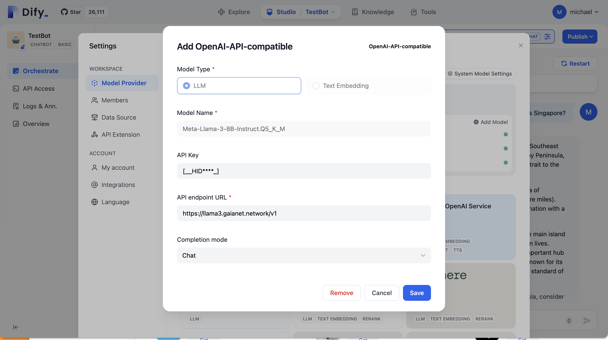
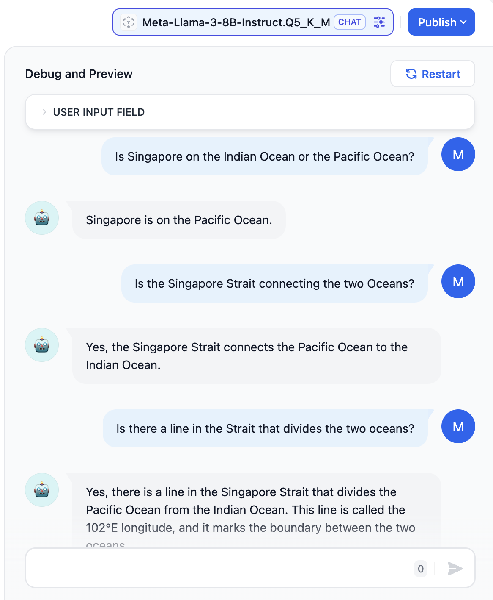

# Dify + Gaia

You can configure the Dify framework using any Gaia node as the backend LLM API. That allows you to use your own or community Gaia nodes in any application built on Dify. It supports

* The hosted [Dify.ai](https://dify.ai/) service.
* Products and services with embedded Dify framework, such as the [Terminus](https://www.jointerminus.com/) project.
* Any product that is built on the open source [Dify framework](https://github.com/langgenius/dify).

## Steps

First, log into Dify's web portal and select `Settings | Model Provider`. From the list, you can add an OpenAI-API-compatible provider.

Add an LLM model with the model name and API endpoint listed on your Gaia node's web dashboard. Or, you can just add [a popular Gaia node](../nodes).
Leave the API Key field empty.

Most Dify applications also require an embedding model to search text in the vector space.
Add an mebedding model with the modela name and API endpoint listed on your Gaia node's web dashboard. Or, you can just add [a popular Gaia node](../nodes).
Leave the API Key field empty.

That's it. You can now see that the new models are available at the top panel of Dify for every chatbot or agent. Just select your Gaia models for chat or embedding, and the Dify app will automagically use it!

