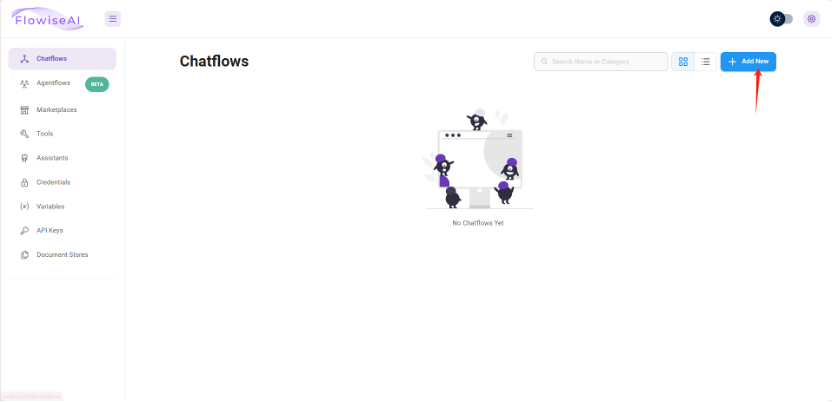
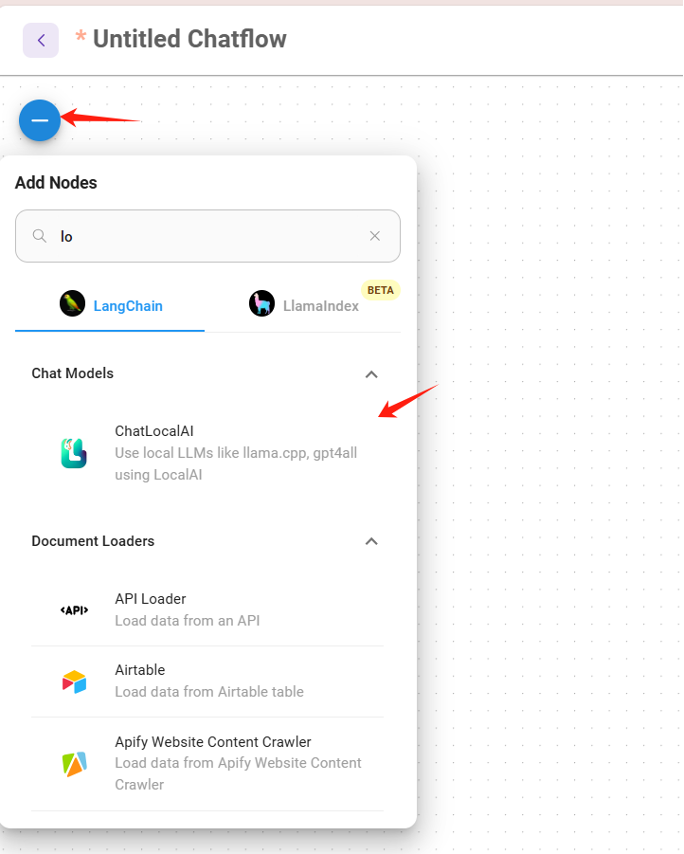
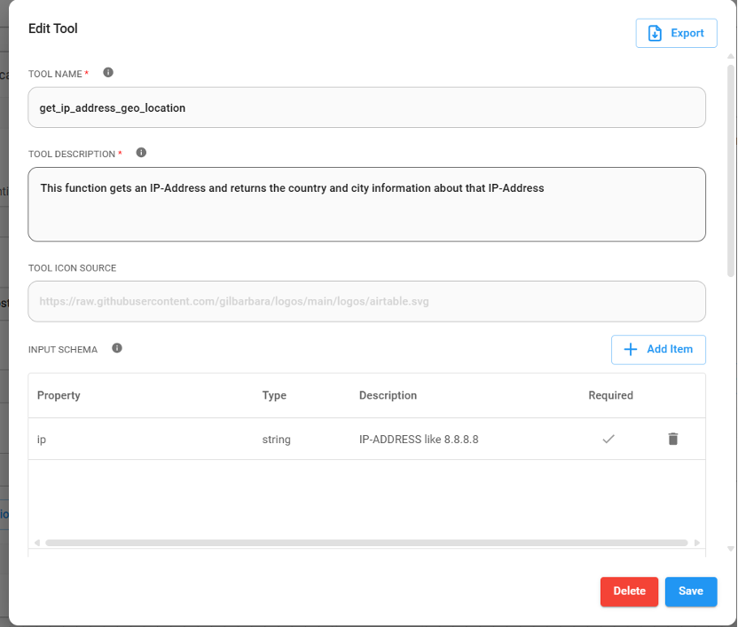
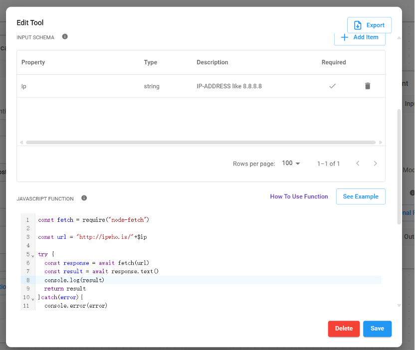
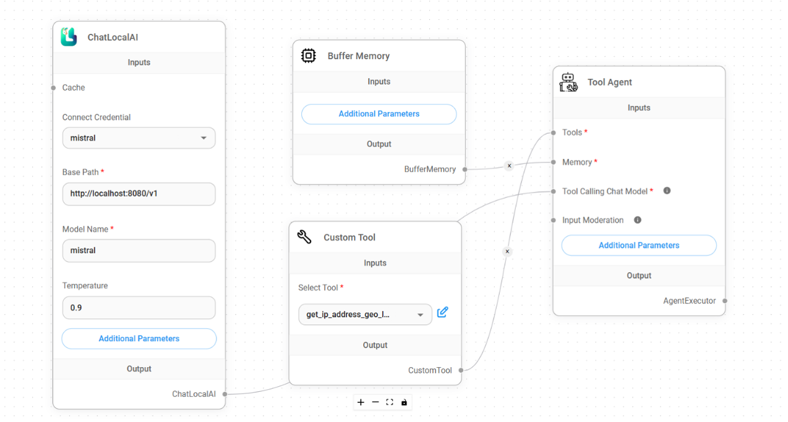
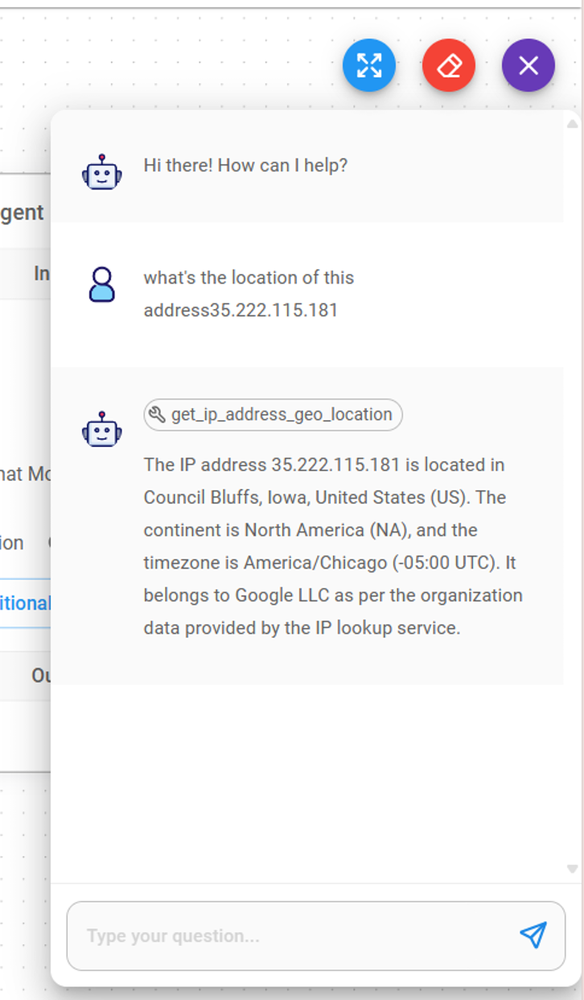

# FlowiseAI tool call

FlowiseAI is a low-code tool for developers to build customized LLM orchestration flows & AI agents. 
You can configure the FlowiseAI tool to use a Gaia node that supports [LLM tool calling](https://github.com/LlamaEdge/LlamaEdge/blob/main/llama-api-server/doc/ToolUse.md).

## Prerequisites

You will need a Gaia node ready to provide LLM services through a public URL.
In this tutorial, you will need to [set up a public node with tool call support](https://github.com/GaiaNet-AI/node-configs/blob/main/mistral-0.3-7b-instruct-tool-call/README.md).

## Start a FlowiseAI server

Follow [the FlowiseAI guide](https://docs.flowiseai.com/getting-started) to install Flowise locally

```
npm install -g flowise
npx flowise start
```

After running successfully, you can open `http://localhost:3000` to check out the Flowise AI tool.

## Build a chatbot for realtime IP lookup

Step 1: Create a new **Chatflow** from the UI.



Step 2: On the **Chatflow** canvas, add a node called **ChatLocalAI**.



Step 3: Configure the **ChatLocalAI** widget to use the Gaia node with tool call support you have created.

* Base path: `https://YOUR-NODE-ID.gaia.domains/v1`
* Model name: e.g., `Mistral-7B-Instruct-v0.3.Q5_K_M`

Step 4: Add a node called **Custom Tool** 

Create a function named `get_ip_address_geo_location`. 
The function requires a `string` parameter called `ip`.

The **Tool description** field is the "prompt" that tells the LLM when to use this function. In this example,
if the LLM detects that the user is asking about the city or country of an IP address, it will
return a tool call response asking FlowiseAI to perform this function call first.



Now you can add JavaScript code for this function. It looks up the location of the input `ip` parameter.

```
const fetch = require("node-fetch")
const url = "http://ipwho.is/"+$ip

try {
  const response = await fetch(url)
  const result = await response.text()
  console.log(result)
  return result
} catch(error) {
  console.error(error)
}
```



Step 5: Add a node called **Buffer Memory** to the canvas.

Step 6: Add a node called **Tool Agent**.

Step 7: Connect the nodes.

Connect the **Custom Tool** and **Buffer Memory** nodes to the appropriate connectors on the 
**Tool Agent** node. Connect the **ChatLocalAI** node to the **Custom Tool**.



Step 8: Save the **Chatflow**.

## Give it a try

From the FlowiseAI UI, you can open a chat window to chat with the **ChatLocalAI** you just created. Let's
ask a question:

```
What's the location of this address 35.222.115.181
```

The LLM understands that the request is to find a location for an IP address, and sees that we have a function
called `get_ip_address_geo_location` in tools, which has a description that matches this task. 
So, it responds with a JSON message to call this function with
the IP address it extracts from the user query.

This tool calling JSON message is NOT displayed to the user in the chatbot. Instead, the FlowiseAI
**Custom Tool** node captures it and executes the JavaScript code associated with this tool call. The result of
the tool call is then sent back to the LLM together with the original query, 
which is why we need the **Buffer Memory** node BTW, 
and the LLM formulates a human readable response to the original question.



