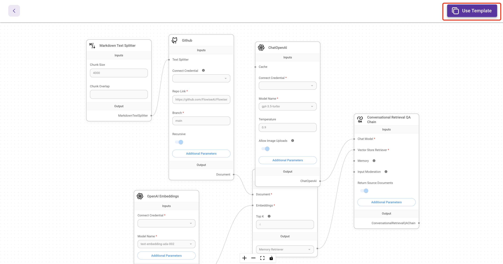

# FlowiseAI RAG chat

FlowiseAI is a low-code tool for developers to build customized LLM orchestration flows & AI agents. You can configure the FlowiseAI tool to use Gaia nodes as LLM service providers.

## Prerequisites

You will need a Gaia node ready to provide LLM services through a public URL. You can

* [run your own node](../../getting-started/quick-start)
* [use a public node](../nodes)

In this tutorial, we will use public nodes to power the Continue plugin.

| Model type | API base URL | Model name |
|-----|--------|-----|
| Chat | https://llama8b.gaia.domains/v1 | llama |
| Embedding | https://llama8b.gaia.domains/v1 | nomic |

## Start a FlowiseAI server

Follow [the FlowiseAI guide](https://docs.flowiseai.com/getting-started) to install Flowise locally

```
npm install -g flowise
npx flowise start
```

After running successfully, you can open http://localhost:3000 to check out the Flowise AI tool.

## Build a documents QnA chatbot

FlowiseAI allows you to visually set up all the workflow components for an AI agent. If you're new to FlowiseAI, it's recommended to use a template quick start. In fact, there are lots of templates around OpenAI in the Flowise marketplace. All we need to do is to replace the ChatOpenAI component with the ChatLocalAI component.

Let's take the **Flowise Docs QnA** as an example. You can build a QnA chatbot based on your documents. In this example, we would like to chat with a set of documents in a GitHub repo. The default template was built with OpenAI and we will now change it to use an open-source LLM on a Gaia node. 

### Get the **Flowise Docs QnA** template


Click on Marketplaces on the left tab to browse all the templates. The template **Flowise Docs QnA** we will use is the first one.



Then, click on Use this template button on the left top corner to open the visual editor.

### Connect the chat model API

You will need to delete the ChatOpenAI component and click the + button to search ChatLocalAI, and then drag the ChatLocalAI to the screen.


Then, you will need to input 

* the Gaia node base URL `https://llama8b.gaia.domains/v1` 
* the model name `llama`

Next, connect the ChatLocalAI component with the field `Chat model` in the **Conversational Retrieval QA Chain** component.

### Connect the embedding model API

The default template uses the OpenAI Embeddings component to create embeddings for your documents. We need to replace the **OpenAI Embeddings** component with the **LocalAI Embeddings** component.

* Use the Gaia node base URL `https://llama8b.gaia.domains/v1` in the Base Path field.
* Input the model name `nomic-embed-text-v1.5.f16` in the Model Name field.

Next, connect the **LocalAI Embeddings** component with the field `embedding` in the **In-Memory Vector Store** component.

### Set up your documents

Then, let's go through the GitHub component to connect the chat application to our documents on GitHub. You will need to put your docs GitHub link into the **Repo Link** field. For example, you can put Gaia's docs link: `https://github.com/GaiaNet-AI/docs/tree/main/docs`.

## Give it a try

You can send a question like "How to install a Gaia node" after saving the current chatflow. 


You will get the answer based on the Gaia docs, which are more accurate.

## More examples

There are lots of examples on the Flowise marketplace. To build a Flowise agent based on Gaia, simply replace the **Chat OpenAI** and **OpenAI Embeddings** component with the Gaia base URL.
