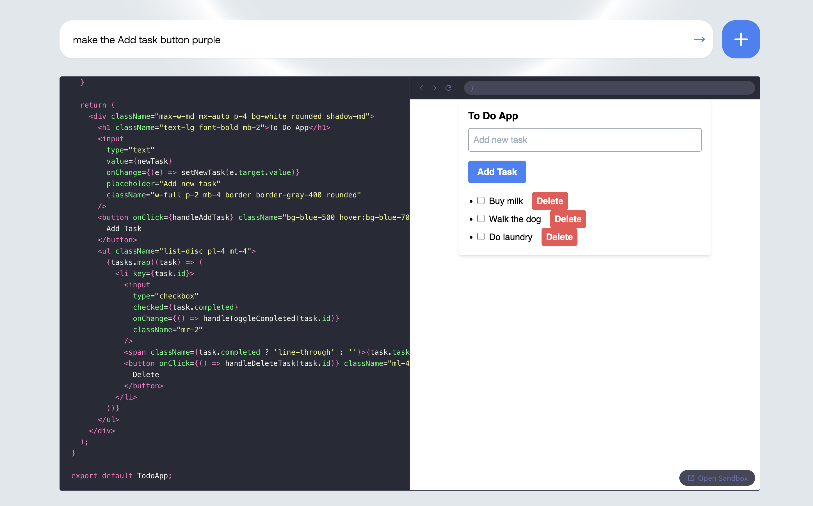

# LlamaCoder 

LlamaCoder is an open-source tool designed to generate small apps with a single prompt. It leverages LLM to help you quickly create and enhance React applications.

## Prerequisites

You will need a Gaia node ready to provide LLM services through a public URL. You can

* [run your own node](../../getting-started/quick-start)
* [use a public node](../nodes)

In this tutorial, we will use a public Llama3 node.

| Attribute | Value |
|-----|--------|
| API endpoint URL | https://llama8b.gaia.domains/v1 |
| Model Name | llama |
| API KEY | gaia |

## Run the agent

First, we will need to get the source code of the forked LlamaTutor

```
git clone https://github.com/second-state/llamacoder.git
cd llamacoder
```

Next, configure the `.env` file.

```
cp .example.env .env
```

You will need to configure three parameters here.

* LLAMAEDGE_BASE_URL: URL for the LLM API base URL.
* LLAMAEDGE_MODEL_NAME: Name of the model to be used.
* LLAMAEDGE_API_KEY: API key for accessing the LLM services.

For example, you can use the following `.env` setting.

```
LLAMAEDGE_BASE_URL=https://llama8b.gaia.domains/v1
LLAMAEDGE_MODEL_NAME=llama
LLAMAEDGE_API_KEY=GaiaNet
```

Then, we will need to install the required dependencies.

```
npm install
```

Next, let's run the application locally.

```
npm run dev
```

Finally, open http://localhost:3000 in your browser and start building your React app.


