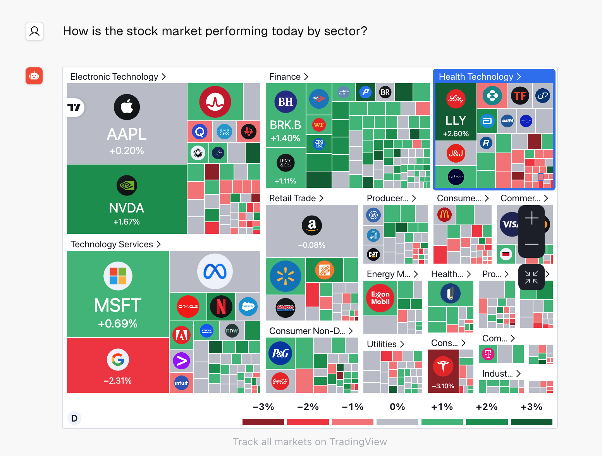

# Stockbot

Stockbot is a lightning fast AI Chatbot that responds with live interactive stock charts, financials, news, screeners, and more. You can configure a Gaia node as the LLM backend.

> Please note, the Stockbot leverages function call to call the external API. You will need to use the model which supports function call, like [llama-3.1-8b](https://github.com/GaiaNet-AI/node-configs/tree/main/llama-3-groq-8b-tool).


## Prerequisites

You will need a Gaia node ready to provide LLM services through a public URL. You can

* [run your own node](../../getting-started/quick-start)
* [use a public node](../nodes)

In this tutorial, we will use a public Llama3 node with the function call support.

| Attribute | Value |
|-----|--------|
| API endpoint URL | https://llamatool.us.gaianet.network/v1 |
| Model Name | llama |
| API KEY | gaia |

## Run the agent

First, we will need to get the source code of the forked Stockbot.

```
git clone https://github.com/JYC0413/stockbot-on-groq.git
cd stockbot-on-groq
```

Next, configure the `.env` file.

```
cp .env.example .env.local
```

You will need to configure four parameters here.

* LLAMAEDGE_BASE_URL: URL for the LLM API base URL.
* LLAMAEDGE_MODEL_NAME: Name of the model to be used.
* LLAMAEDGE_API_KEY: API key for accessing the LLM services.

Then, we will need to install the required dependencies.

```
npm install
```

Next, let's run the application locally.

```
npm run dev
```

Finally, you can open http://localhost:3000 and ask the stock related questions.


