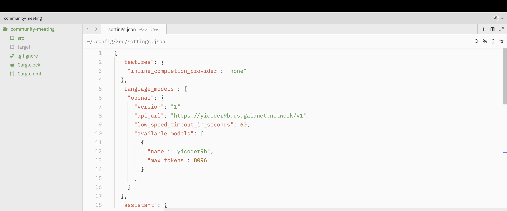
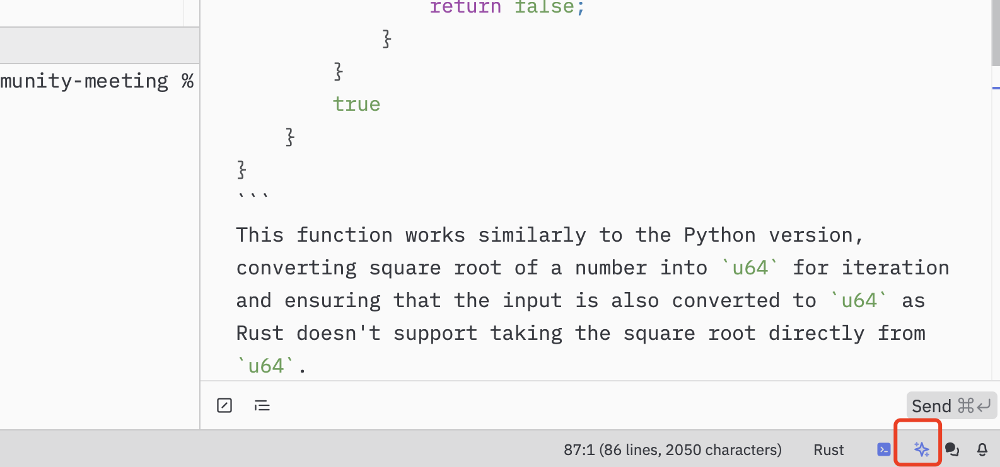
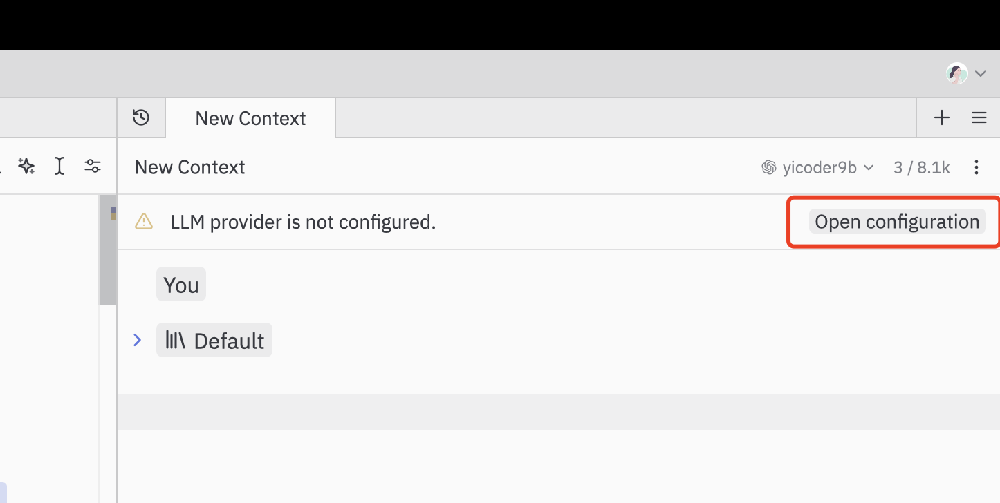
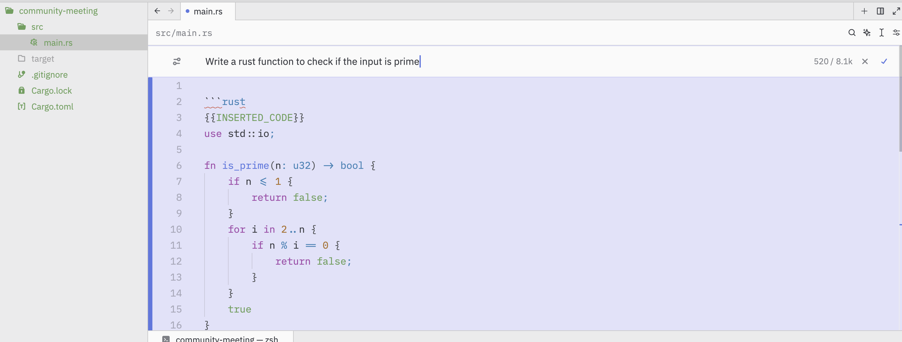
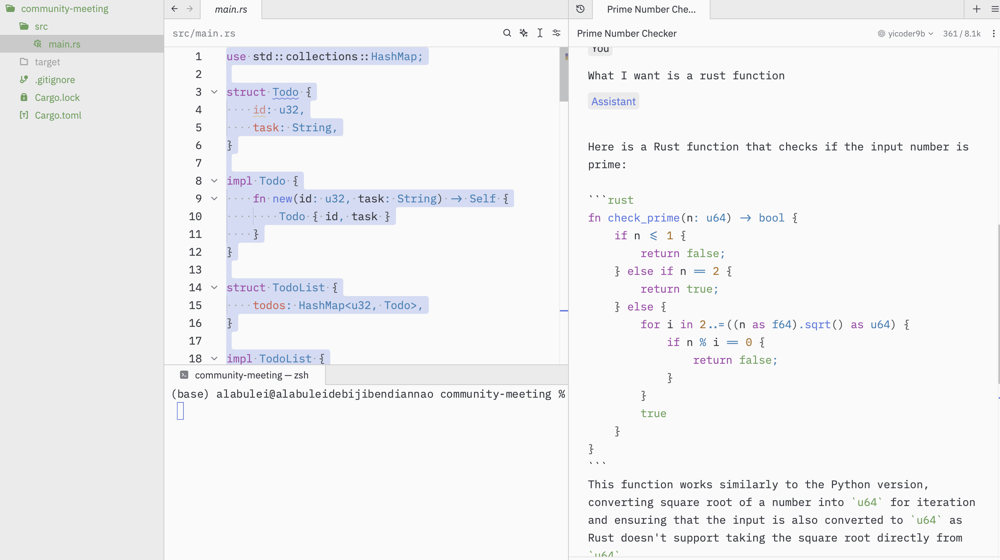

# Zed


[Zed](https://zed.dev/) is a next-generation code editor designed for high-performance collaboration with humans and AI, and it is written in Rust.  You can use Zed with your own Gaia node as the LLM backend. There are two big reasons for that

* Your Gaia node could be supplemented by a knowledge base that is specific to your proprietary code repository, programming language choices, and coding guidelines/styles.
* Your Gaia node could ensure that your code stays private within your organization.

<iframe width="100%" style={{"aspect-ratio": "16 / 9"}} src="https://www.youtube.com/embed/icbFAAOZYcE" title="A Rust coding assistant on Zed" frameborder="0" allow="accelerometer; autoplay; clipboard-write; encrypted-media; gyroscope; picture-in-picture; web-share" referrerpolicy="strict-origin-when-cross-origin" allowfullscreen></iframe>

## Prerequisites

You will need a Gaia node to provide LLM services to Zed. You can

* [run your own node](../../getting-started/quick-start)
* [use a public node](../nodes)

In this tutorial, we will use public [Qwen 2.5 Coder](https://github.com/QwenLM/Qwen2.5-Coder) nodes to power Cursor.

| Model type | API base URL | Model name |
|-----|--------|-----|
| General coding assistant | `https://coder.gaia.domains/v1` | coder |
| Coding assistant with Rust knowledge | `https://rustcoder.gaia.domains/v1` | rustcoder |
| Rust expert (slower but more accurate) | `https://rustexpert.gaia.domains/v1` | rustexpert |

> A limitation of Cursor is that it does not support local LLM services. A Gaia node comes with a default networking tunnel that turns your local LLM service into a HTTPS service accessible from the Internet. That allows Cursor to use your own private LLM for coding. Start your own [Qwen Coder](https://github.com/GaiaNet-AI/node-configs/tree/main/qwen-2.5-coder-7b-instruct) or [Qwen Coder with Rust](https://github.com/GaiaNet-AI/node-configs/tree/main/qwen-2.5-coder-7b-instruct_rustlang) nodes today!

## Configure Zed

First, download and install [Zed](https://zed.dev/). Click on your profile on the top right and choose **Setting**. Then a new tab called `settings.json` will be opened. You can configure your Zed by editing this file.



Below is the `settings.json` we used. You can copy and paste sections `language_models` and `assistant` to your own. They configure Zed to use an OpenAI-compatible API provider and then specify the API endpoint URL and model name for that provider.

```
{
  "features": {
    "inline_completion_provider": "none"
  },
  "language_models": {
    "openai": {
      "version": "1",
      "api_url": "https://rustcoder.gaia.domains/v1",
      "low_speed_timeout_in_seconds": 60,
      "available_models": [
        {
          "name": "yicoder9b",
          "max_tokens": 8096
        }
      ]
    }
  },
  "assistant": {
    "provider": "openai",
    "default_model": {
      "provider": "openai",
      "model": "yicoder9b"
    },
    "version": "2"
  },
  "ui_font_size": 16,
  "buffer_font_size": 16,
  "theme": {
    "mode": "system",
    "light": "One Light",
    "dark": "One Dark"
  }
}
```

Next we will configure the API key to access this Gaia node.

Go back to the folder you opened. Click on the Star icon at the bottom to turn on the Assistant panel.
  


Click on **Open configuration** to set up the API Key.
  


Since we are using a free public Gaia node, you can use any API key in the OpenAI section at the bottom of the screen. For example, you can enter `GAIA`.

Now, we have everything ready.

# Use Zed

You can

* Edit the highlighted code by selecting the code and clicking on the **Inline Assistant** button.



* Open the Assistant panel by clicking on the **Assistant** icon at the bottom to turn on the Assistant panel.




