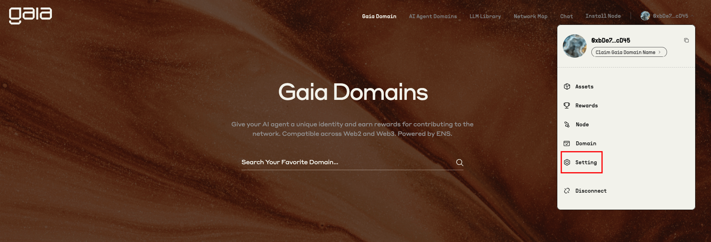
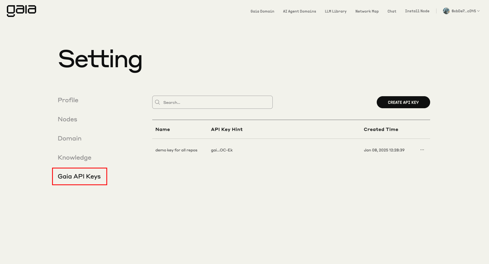
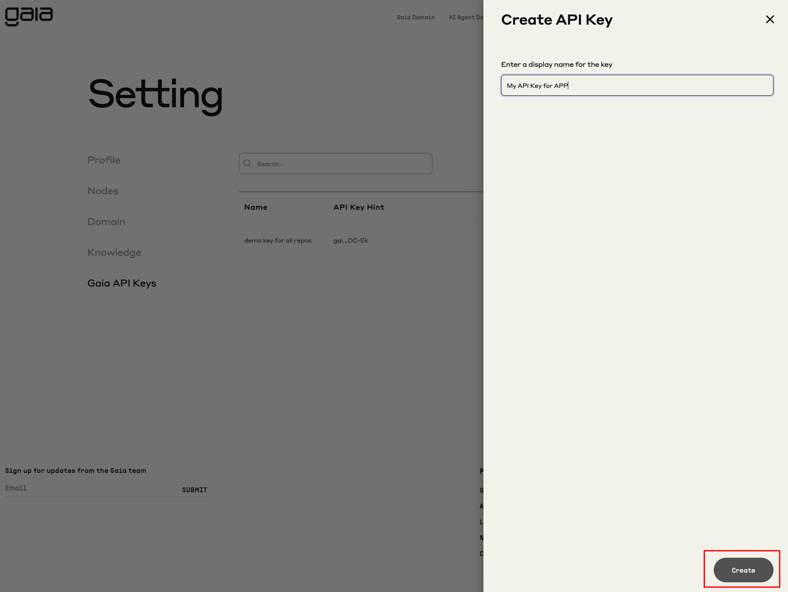
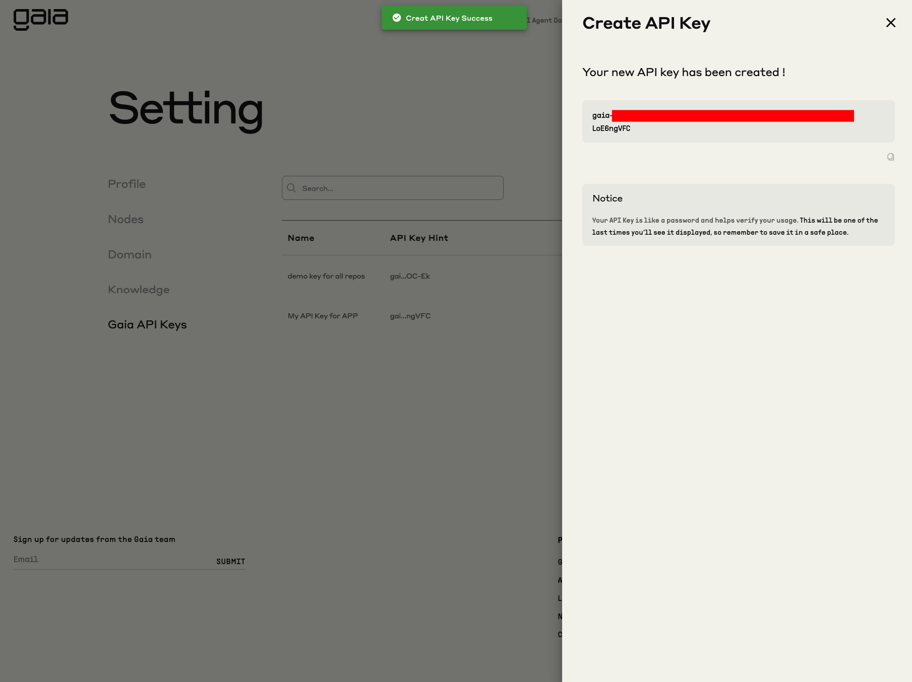

# Get your API key

We're introducing API keys for authentication. You can create API keys by following the steps below:

1. Go to https://gaianet.ai and click on **Launch App**
2. Click **CONNECT** and connect your Metamask Wallet
3. After connecting your wallet, click on the profile drop down and then click **Setting**
   

4. Under **Setting**, click on **Gaia API Keys** and then **Create API Key**
   

5. Give your API Key a name and click **Create**

:::danger Important

Remember that your API key is a secret! Do not share it with others or expose it in any client-side code (browsers, apps). Production requests must be routed through your own backend server where your API key can be securely loaded from an environment variable or key management service.

:::

:::tip Tip

Your API Key is like a password and helps verify your usage. This will be one of the last times you‘ll see it displayed, so remember to save it in a safe place.

:::

## Important

#### API Keys are now available for all your applications and usage.

Currently, we don't charge anything for usage or API key creation. However, it is highly recommended that you start using and updating your existing applications or new ones with your own API keys to avoid any disruption in the future.

<<<<<<< HEAD
Please refer to the [API Reference](../api-reference.md) page for the updated examples with the API keys usage.
=======
Please refer to the [API Reference](../api/api-reference.md) page for the updated examples with the API keys usage.
>>>>>>> 586867f (update image paths and refences)
