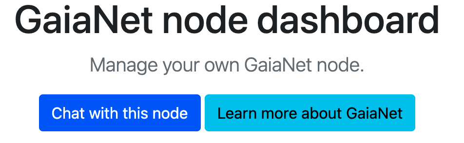

# Using your Gaia Node

When you [start a Gaia node](../quick-start/quick-start.md), or you find a node on the web, you could use it as a
web-based chatbot UI and an OpenAI compatible web service. Just load the node's public URL in the browser to open its dashboard.
Let's say the URL is as follows.

```
https://0x1234...xyz.gaia.domains/
```

> Please refer to the [agent apps](../../agent-integrations/intro) section to see how to use the Gaia node API in your favorite agent frameworks or apps.

## Web-based chatbot

On the Gaia node dashboard, you will see a "Chat with this node" button. 



## OpenAI API replacement

The Gaia node is a drop-in replacement for OpenAI API in [agent and LLM apps](../../agent-integrations/intro).
On the Gaia node dashboard, you will see a table that shows how to replace OpenAI parameters in those apps.


