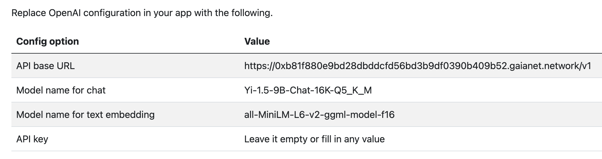

# What is a Gaia node?

A Gaia node is an open-source developer platform that lets anyone build, launch, scale and monetize AI agents. It's like having your own personal AI assistant that you can customize and share with others. 

Here's a breakdown of the key components inside a Gaia node:

- **WasmEdge Runtime**: WasmEdge is a lightweight, high-performance, and extensible WebAssembly runtime for cloud native, edge, and decentralized applications. It powers serverless apps, embedded functions, microservices, smart contracts, and IoT devices. It is the easiest and the fastest way to run LLMs on your own devices. Check the Github of WasmEdge [here](https://github.com/WasmEdge/WasmEdge).
- **LLM (Large Language Models)**: You can use any LLM from Huggingface, which is a platform hosting thousands of open-source models. Gaia has its own organization page on Huggingface where you can find optimized models for Gaia nodes. You can choose or fine-tune these models for specific tasks or knowledge areas. For example, you could select a model that's an expert in chemistry or one that mimics a particular writing style. Checkout Gaia on Huggingface [here](https://huggingface.co/gaianet).
- **RAG (Retrieval-Augmented Generation)**: This component helps the AI access and use relevant information from a knowledge base. It's like giving the AI the ability to quickly look up facts in a specialized encyclopedia before answering questions.
- **Vector Database**: This stores information in a format that the AI can easily search and understand. It's similar to how a library organizes books, but for AI-friendly data.
- **Multimodal | Embedding Models**: These allow the node to understand and work with different types of data, like text, images, or even audio. The embedding part helps convert this information into a format the AI can process efficiently.
- **API Server**: This is the interface that allows users or applications to interact with the Gaia node. It's like a reception desk that takes requests and returns answers.
- **Tool Usage and Function Calling**: These components allow the AI to use external tools or perform specific actions. For instance, the AI could use a calculator tool to solve math problems or call a weather API to get current weather information.
- **Prompt Selection and Management**: This helps guide the AI's responses by providing context or instructions. It's like giving the AI a script to follow for different scenarios.
- **Node ID**: This is a unique identifier for each Gaia node, allowing it to be recognized and connected to the larger Gaia system.

Each Gaia node provides a specialized API service that encapsulates a unique combination of

- a specialized and fine-tuned LLM (e.g., an LLM that excels in answering questions about the Rust programming language)
- a domain-specific knowledge base (e.g., knowledge about the WasmEdge project)
- an inference app that manages the context and history of conversations (e.g., RAG and MemGPT prompt injection)
compute resources required to run the LLM app as an API service (e.g., a Nvidia GPU or a Mac M3 device)

The Gaia node API service is fully compatible with the OpenAI JSON spec, and hence each Gaia node can function as an alternative backend for OpenAI-based frontends or agents.

## Gaia Protocol

The Gaia protocol connects and incentivizes Gaia nodes and domains to form a coherent network of web services for AI agents. It provides a mechanism to discover, connect to, and pay for Gaia node services through a decentralized marketplace. It also incentivizes domains to manage node agents through a staking program. Furthermore, the Gaia protocol connects model creators (i.e., people who have skills to finetune models) and knowledge providers to node operators through a marketplace.

