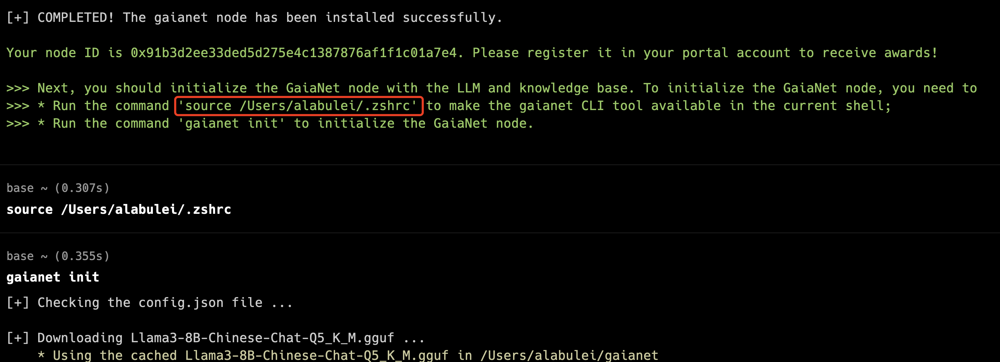

# Setting up your own node
This guide provides the requisite knowledge necessary to quickly get started with installing a Gaia node. 

### Prerequisites
Before you get started, ensure that you have the following on your system:

| System | Minimum Requirements |
|---|---|
| OSX with Apple Silicon (M1-M4 chip) | 16GB RAM (32GB recommended) |
| Ubuntu Linux 20.04 with Nvidia CUDA 12 SDK | 8GB VRAM on GPU |
| Azure/AWS | Nvidia T4 GPU Instance |

Learn more about [system requirements](system-requirements). (Also Note when you're using a windows system you should have ubuntu installed so you use wsl in the command line)

### Installing the node

1.  Use the following command to download the latest version of the Gaia node:

```
curl -sSfL 'https://github.com/GaiaNet-AI/gaianet-node/releases/latest/download/install.sh' | bash
```

2.  Run the command printed on the terminal to set up the environment path, it is started with `source`.


3. Use the following command to initialize the Gaia node according to the configuration options 
in `$HOME/gaianet/config.json`.
By default, the Gaia is initialized with a [Llama 3.2](https://huggingface.co/meta-llama/Llama-3.2-1B-Instruct) LLM and a [knowledge base about Paris](https://huggingface.co/datasets/gaianet/paris). 
This command could take some time since it will download a very large LLM file.

```
gaianet init
```

4. Use the following command to start your node:

```
gaianet start
```

#### After starting your node

- A successful start prints a public URL for the node. Opening a browser to that URL will display the node information and allow you to chat with the AI agent on the node. 

```
... ... https://0xf63939431ee11267f4855a166e11cc44d24960c0.gaia.domains
```

- To stop the node: `gaianet stop`

## Video Guide

<iframe width="100%" style={{"aspect-ratio": "16 / 9"}} src="https://www.youtube.com/embed/LVYXtg39t6c?si=8KQapGzm0gKyZR52" title="YouTube video player" frameborder="0" allow="accelerometer; autoplay; clipboard-write; encrypted-media; gyroscope; picture-in-picture; web-share" referrerpolicy="strict-origin-when-cross-origin" allowfullscreen></iframe>

## Next steps

- [Customize](../customize/customize.md) your node. You probably do not wish to just run the default Phi-3 model and Paris knowledge base. 
- [Join the Gaia Protocol](../register/register.md) and join the Gaia protocol network to receive payments.
- [Ensure Node Reliability](../advanced-deployment-options/protect.md) the node server to ensure stable service.

