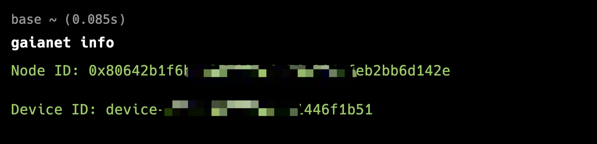
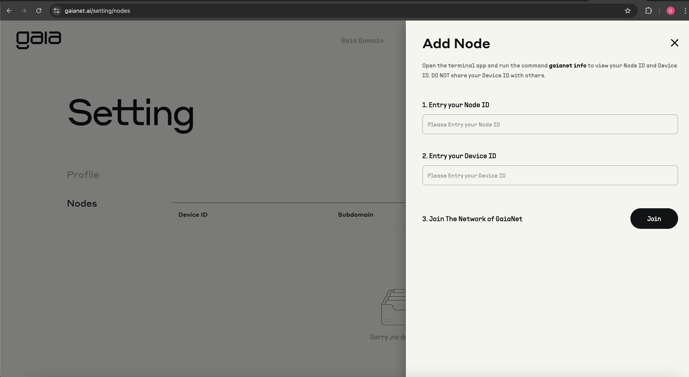

# Joining the Gaia Protocol

After successfully running a Gaia node on your machine, it's time to join the Gaia protocol network and get rewards for sharing computing power with the world by binding your node ID and device ID to a Metamask account.

When you run a node with the Getting Started guide, you may notice that the Gaia software has generated a node ID for you. The node ID is an ETH address. The easiest way to find the node ID is to use `gaianet info` to print the node ID and device ID on the terminal.

```
gaianet info
```
The output will be the following:

```
Node ID: 0x80642b1----9a76a284efeb2bb6d142e

Device ID: device-e77---1446f1b51
```


To receive rewards, bind your node and device IDs with a Metamask account using the Gaia web portal:

1. Open https://www.gaianet.ai/ on your browser and click **"Connect."**
2. Log into Metamask using the QR code and connect your account. 
3. Hover on your profile and click **"Setting"** and click **"Nodes."** 
4. Click **"Connect new node"** and enter your node and device IDs in the boxes.
5. Click **"Join"**   


After your node has successfully joined the network, it will be displayed in the list of nodes on the Node Page.

:::note

If you are running multiple nodes, you can bind the node IDs and their corresponding device IDs to your MetaMask wallet.

:::

### Protect your node ID and device ID

The Gaia installer generates a pair of ETH address and keystore and password for your node automatically. This information is stored in the `gaianet/nodeid.json` file. Please keep the JSON file carefully.

- The ETH address is your node ID. You will use this ETH address to join the Gaia network.
- The keystore stores the private key associated with the ETH address encrypted by the password.

:::tip

The `nodeid.json` file is the only proof that your node belongs to you. 
In many protocol operations, you will need this private key to sign request messages to send to the protocol smart contracts.

:::

:::note

The device ID is only visible to yourself.

:::

### Select a different domain

By default, a new Gaia node joins the `gaianet.network` domain. You can select a different domain to join by putting
the Gaia domain's public DNS name in the `domain` field in the `config.json`. Please note that most Gaia domains
require approval for nodes to join. You have to abide by the domain's rules before your node can become publicly accessible
on the domain URL.

