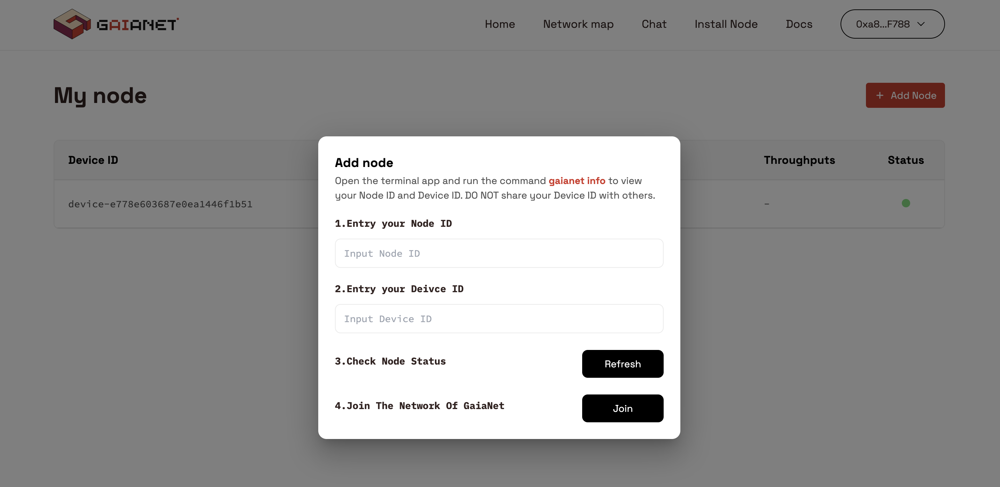
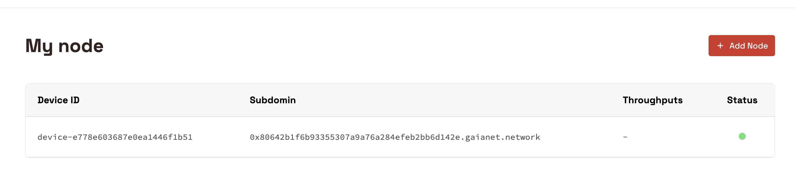

# Join the GaiaNet Protocol

After successfully running a GaiaNet node on your machine, it's time to join the GaiaNet protocol network and get rewards for sharing computing power with the world by binding your node ID and device ID to a Metamask account.

When you run a node with the Getting Started guide, you may notice that the GaiaNet software has generated a node ID for you. The node ID is an ETH address. The easiest way to find the node ID is to use `gaianet info` to print the node ID and device ID on the terminal.

```
gaianet info
```
The output will be the following:

```
Node ID: 0x80642b1----9a76a284efeb2bb6d142e

Device ID: device-e77---1446f1b51
```


To receive your rewards, all you need to do is bind your node ID and device id with a Metamask account via the GaiaNet web portal.

* Open https://www.gaianet.ai/ on your browser and log in to the website with your Metamask account
* Select the **Setting** section by clicking on your account, then click on the nodes and ** Connect New Node** button.
* Next copy and paste your node ID into the relevant field and do the same for the device ID in the second box. Then, click on the Join button.
  


* After your node is joined successfully, it will be displayed in the list of nodes on the Node Page.



* You can bind multiple node IDs and its corresponding device IDs to your MetaMask wallet address if you are running multiple nodes.


> Please noted, don't share the device ID with others.

### Protect your node ID and device ID

The GaiaNet installer generates a pair of ETH address and keystore and password for your node automatically. This information is stored in the `gaianet/nodeid.json` file. Please keep the JSON file carefully.

* The ETH address is your node ID. You will use this ETH address to join the GaiaNet network.
* The keystore stores the private key associated with the ETH address encrypted by the password.

The `nodeid.json` is the only proof that your node belongs to you. 
In many protocol operations, you will need this private key to sign request messages to send to the protocol smart contracts.

The device id is only visible to yourself.

### Select a different domain

By default, a new GaiaNet node joins the `gaianet.network` domain. You can select a different domain to join by putting
the GaiaNet domain's public DNS name in the `domain` field in the `config.json`. Please note that most GaiaNet domains
require approval for nodes to join. You have to abide by the domain's rules before your node becomes publically accessible
on the domain URL.

