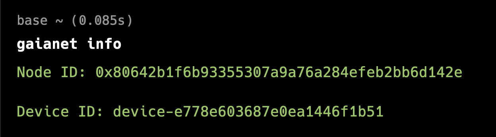

# Joining the Gaia Protocol

To join the Gaia protocol, you will need to complete the following two tasks.

* Bind your node by connecting your node ID and device ID.
* Join a Gaia domain

## Bind your node

After successfully running a Gaia node on your machine, it's time to join the Gaia protocol network and get rewards for sharing computing power with the world by binding your node ID and device ID to a Metamask account.

When you run a node with the Getting Started guide, you may notice that the Gaia software has generated a node ID for you. The node ID is an ETH address. The easiest way to find the node ID is to use `gaianet info` to print the node ID and device ID on the terminal.

```
gaianet info
```
The output will be the following:

```
Node ID: 0x80642b1----9a76a284efeb2bb6d142e

Device ID: device-e77---1446f1b51
```


To receive rewards, bind your node and device IDs with a Metamask account using the Gaia web portal:

1. Open https://www.gaianet.ai/ on your browser and click **"Connect."**
2. Log into Metamask using the QR code and connect your account. 
3. Hover on your profile and click **"Setting"** and click **"Nodes."** 
4. Click **"Connect new node"** and enter your node and device IDs in the boxes.
5. Click **"Join"**   


After your node has successfully joined the network, it will be displayed in the list of nodes on the Node Page.

**If you are running multiple nodes, you can bind the node IDs and their corresponding device IDs to your MetaMask wallet.**

### Protect your node ID and device ID

The Gaia installer generates a pair of ETH address and keystore and password for your node automatically. This information is stored in the `gaianet/nodeid.json` file. Please keep the JSON file carefully.

- The ETH address is your node ID. You will use this ETH address to join the Gaia network.
- The keystore stores the private key associated with the ETH address encrypted by the password.

The `nodeid.json` file is the only proof that your node belongs to you. 
In many protocol operations, you will need this private key to sign request messages to send to the protocol smart contracts.

The device ID is only visible to you.


## Join a Domain

Once your node is successfully bound, you can proceed to join a Gaia Domain.

### Steps to Join a Domain

1. **Locate Your Nodes**  
   Navigate to **Profile → Nodes** to view the list of nodes you already registered.

2. **Initiate the Join Process**  
   Click the `...` button next to your node and select **Join Domain**. This will guide you through the steps to join a Gaia Domain.


3. **Follow the Join Steps**  
   - **Update Node Domain**  
     Change your node's domain to `gaia.domains`, which is necessary. The following command line will change your node's domain to `gaia.domains`. If your node has already used `gaia.domains`, then you can skip this step.
   
     ``` 
     gaianet stop
     gaianet config --domain gaia.domains
     gaianet init
     gaianet start
     ```
     
   - **Select a Domain**  
     Choose a domain from the available online domain list. You can review essential details for each domain, such as:  
       - Required LLM  
       - Join policy  
       - Number of joined nodes
   
   

   - **Verify Node Status**  
     Ensure your node meets the domain's requirements. If everything checks out, you can submit a join request to the domain.

   

    > Normally, your node needs to be online and meet the specific LLM requirement.


### Important Notes

- Some Gaia Domains require approval for new nodes to join.  
- Ensure you comply with the domain's rules before your node becomes publicly accessible under the domain's URL. 

Following these steps will seamlessly integrate your node into a Gaia Domain.

