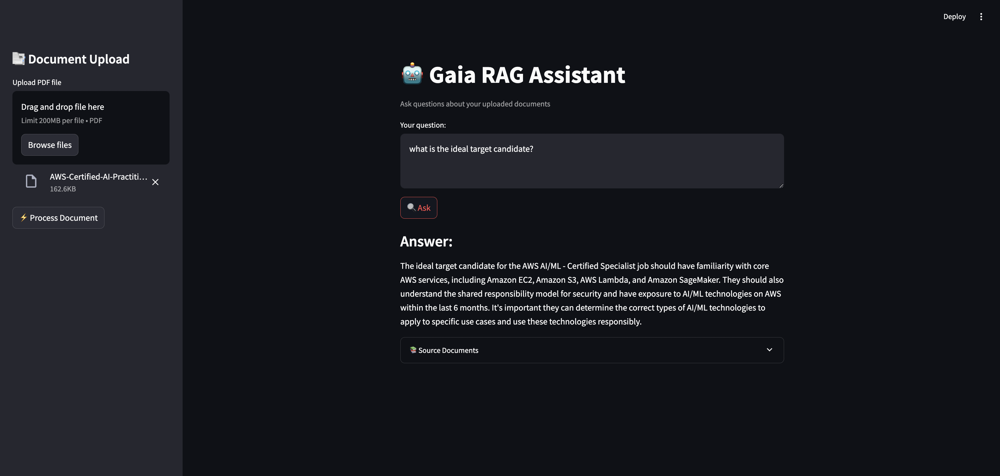

# PDF Question-Answering with Gaia and Qdrant

Gaia PDF RAG is a Retrieval-Augmented Generation (RAG) application that allows users to ask questions about PDF documents using a local Gaia node and Qdrant vector database. It combines the power of local LLMs with efficient vector search to provide accurate, context-aware answers.





:::info

The complete source code and detailed instructions for setting up and running this example can be found in the [Gaia Cookbook repository](https://github.com/GaiaNet-AI/gaia-cookbook/tree/main/python/gaia-pdf-rag).

:::

**What You Can Learn and Build:**

By exploring and adapting this example, you can learn how to:

* **Process and Chunk PDF Documents:** Understand the steps involved in breaking down PDF files into manageable segments for effective retrieval.
* **Implement Semantic Search with Qdrant:** See how to leverage a vector database for efficient and context-aware searching of your document chunks.
* **Integrate Local LLMs via Gaia:** Learn how to connect to your local Gaia node to utilize the power of locally hosted language models for question answering.
* **Enhance Relevance with Cross-Encoder Reranking:** Discover techniques to refine search results and improve the accuracy of retrieved information.
* **Provide a Seamless User Experience with Streaming Responses:** Implement real-time feedback for users as the answer is generated.
* **Ensure Trustworthiness with Smart Source Citation:** Learn how to provide clear references to the source documents for each answer.
* **Mitigate Hallucinations with Relevance Filtering:** Explore strategies to filter out irrelevant information and reduce the likelihood of inaccurate responses.
* **Build a Customizable PDF Q&A Bot:** This example provides a solid foundation for you to tailor and deploy your own question-answering system for specific PDF documents or collections.

**Key Features Demonstrated:**

* 📑 **PDF Document Processing and Chunking:** Efficiently handles the extraction and segmentation of content from PDF files.
* 🔍 **Semantic Search using Qdrant:** Leverages vector embeddings for intelligent retrieval of relevant document parts.
* 🤖 **Local LLM Integration through Gaia node:** Connects to your locally running LLM for generating answers based on retrieved context.
* ↗️ **Cross-encoder reranking for improved relevance:** Optimizes search results by applying a more sophisticated ranking model.
* 💨 **Streaming responses for better UX:** Provides a more interactive and responsive user experience.
* 🎯 **Smart source citation:** Clearly indicates the source documents used to generate each answer.
* ⚡ **Relevance filtering to prevent hallucinations:** Enhances the reliability of answers by filtering out less relevant information.

**Getting Started:**

## Prerequisites

Before running Gaia RAG, ensure you have:

1. A local Gaia node running (Check this link to learn how to run your own local LLM: [https://docs.gaianet.ai/node-guide/quick-start](https://docs.gaianet.ai/node-guide/quick-starthttps://docs.gaianet.ai/node-guide/quick-start))
2. Qdrant server running
3. Python 3.8+
4. Required system libraries for PDF processing

## Installation

1. Clone the repository:
```bash
git clone https://github.com/harishkotra/gaia-pdf-rag.git
cd gaia-pdf-rag
```

2. Create a virtual environment:
```bash
python -m venv venv
source venv/bin/activate  # On Windows use: venv\Scripts\activate
```

3. Install dependencies:
```bash
pip install -r requirements.txt
```

## Setting Up Components

### 1. Gaia Node

Start your local Gaia node:
```bash
gaianet init
gaianet start
```

### 2. Qdrant Server

Start Qdrant using Docker:
```bash
docker run -d -p 6333:6333 -p 6334:6334 \
    -v $(pwd)/qdrant_storage:/qdrant/storage \
    qdrant/qdrant
```

## Running the Application

1. Make sure both Gaia node and Qdrant are running

2. Start the Streamlit app:
```bash
streamlit run app.py
```

3. Open your browser at `http://localhost:8501`

## Usage

1. Upload a PDF document using the sidebar
2. Click "Process Document" to index it
3. Ask questions in the main input field
4. View answers and relevant source documents

## Configuration

You can modify the following parameters in `app.py`:

- `GAIA_NODE_URL`: URL of your local Gaia node
- `QDRANT_HOST`: Qdrant server host
- `QDRANT_PORT`: Qdrant server port
- `VECTOR_SIZE`: Embedding dimension size
- `COLLECTION_NAME`: Name for vector database collection

## Project Structure

```
gaia-pdf-rag/
├── app.py              # Main Streamlit application
├── requirements.txt    # Python dependencies
├── .gitignore          # Gitignore file
├── README.md           
```

:::info

The complete source code and detailed instructions for setting up and running this example can be found in the [Gaia Cookbook repository](https://github.com/GaiaNet-AI/gaia-cookbook/tree/main/python/gaia-pdf-rag).

:::