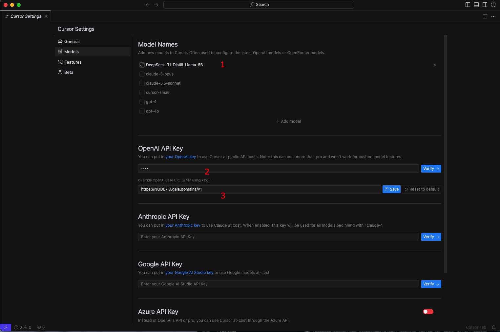

# Integrating DeepSeek R1 with Cursor Editor

## Overview

This guide walks through setting up a private coding assistant by integrating the **DeepSeek R1 Distilled Llama-8B** model with Cursor editor. This setup provides efficient code assistance while keeping your code private and secure.

## Prerequisites

### Hardware Requirements

**Recommended Configuration:**
- Mac with 16GB RAM
- NVIDIA GPU or Huawei Ascend NPU

**Minimum Requirements:**
- Machine with 16GB RAM

## Installation

### Step 1: Install Gaia Software

Run the following command to install Gaia:

```bash
curl -sSfL 'https://github.com/GaiaNet-AI/gaianet-node/releases/latest/download/install.sh' | bash
```

### Step 2: Initialize DeepSeek R1 Model

Download and initialize the **DeepSeek R1 Distilled Llama-8B** model:

```bash
gaianet init --config https://raw.githubusercontent.com/GaiaNet-AI/node-configs/main/deepseek-r1-distill-llama-8b/config.json
```

### Step 3: Start the Model

Launch Gaia and run the model:

```bash
gaianet start
```

Upon successful startup, you'll receive an HTTPS URL (e.g., `https://NODE-ID.gaia.domains`).

:::note

We start the DeepSeek R1 model with an 8k context window by default. If your machine has larger GPU memory (e.g., 64GB), you can increase the context size to 128k. A larger context window is particularly useful in coding tasks, as we need to compress large source code files into prompts to complete complex tasks.

:::

## Cursor Configuration

1. Open Cursor settings


2. Locate the LLM Backend configuration


3. Configure the following:
    - Base API URL: Your Gaia node HTTPS URL
    - Model Name: `DeepSeek-R1-Distill-Llama-8B`
    - API Key: Make sure to replace `YOUR_API_KEY_GOES_HERE` with your **own API key**. To get your own API key, follow [this](../getting-started/authentication) tutorial.



## Technical Details

### WasmEdge Runtime Features
The implementation uses WasmEdge, a WebAssembly-based runtime hosted by CNCF under the Linux Foundation, offering:

- Lightweight deployment (30MB)
- No dependencies required
- Root-free operation
- Cross-platform compatibility
- Sandbox isolation
- Multimodal model support
- Cloud-native integration

### Context Window

- Default: 8k context window
- Expandable to 128k with 64GB GPU memory
- Larger context windows enable processing of bigger source code files

## Usage Tips

- Use for code generation tasks
- Get code explanations
- Build complete applications
- Perfect for maintaining code privacy
- Suitable for both personal and enterprise use

:::note

[Other DeepSeek large models](https://huggingface.co/collections/gaianet/deepseek-r1-and-distills-67954070e0c6002f119c9bb5) on this page are equally applicable, so give them a try in your Cursor! If you find it interesting or encounter any issues, please star our [GitHub repo](https://github.com/LlamaEdge/LlamaEdge) or raise an issue.

:::

## Troubleshooting

If you encounter issues:

- Verify hardware requirements are met
- Ensure Gaia is properly installed
- Check Cursor configuration settings
- Confirm HTTPS URL is correctly entered

## Video Guide

<iframe width="100%" style={{"aspect-ratio": "16 / 9"}} src="https://www.youtube.com/embed/-6e4xp-oFcA" title="YouTube video player" frameborder="0" allow="accelerometer; autoplay; clipboard-write; encrypted-media; gyroscope; picture-in-picture; web-share" referrerpolicy="strict-origin-when-cross-origin" allowfullscreen></iframe>