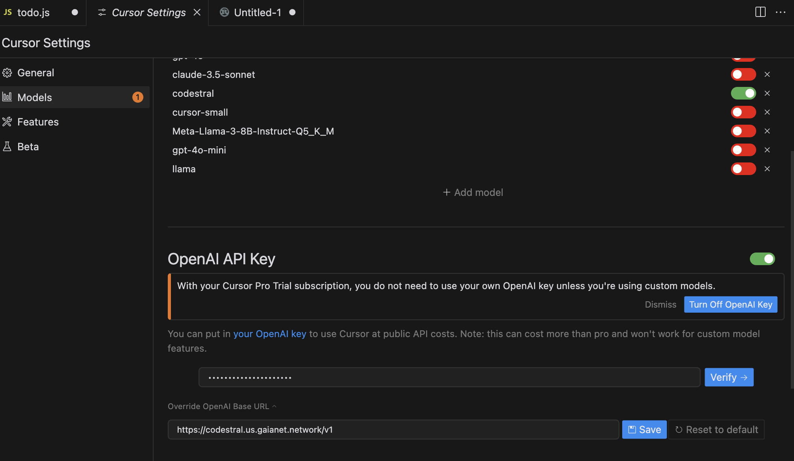

# Cursor AI IDE

[Cursor](https://www.cursor.com/) is an AI-powered code editor / IDE. Using LLMs to generate and review code, Cursor is an alternative to the very popular GitHub Copilot. 
You can use Cursor with your own Gaia node as the LLM backend. There are two big reasons for that

* Your Gaia node could be supplemented by a knowledge base that is specific to your proprietary code repository, porgramming language choices, and coding guidelines / styles.
* Your Gaia node could ensure that your code stays private within your organization.

## Prerequisites

You will need a Gaia node to provide LLM API services. You can

* [run your own node](../../node-guide/quick-start.md)
* [use a public node](../nodes.md)

In this tutorial, we will use a public [Llama 3.1 8b](https://github.com/GaiaNet-AI/node-configs/tree/main/llama-3.1-8b-instruct) node to power Cursor.

| Model type | API base URL | Model name |
|-----|--------|-----|
| Chat | https://llama.us.gaianet.network/v1/ | llama |

> A limitation of Cursor is that it does not support local LLM services. A Gaia node comes with a default networking tunnel that turns your local LLM service into a HTTPS service accessible from the Internet. That allows Cursor to use your own private LLM for coding. Start your own [Llama 3.1](https://github.com/GaiaNet-AI/node-configs/tree/main/llama-3.1-8b-instruct) or [Phi 3.5](https://github.com/GaiaNet-AI/node-configs/tree/main/phi-3.5-mini-instruct) models today! Both are quite good at coding tasks.

## Configure Cursor

First, download and install [Cursor](https://www.cursor.com/). Click on the **Settings** button on the top right. Then, click on **Models** to configure the backend LLM service.

Second, add a model named `llama` and turn off all the other models like `gpt-4o`.

Third, go to the OpenAI API Key section,

* Click on **Override OpenAI Base URL**. Type `https://llama.us.gaianet.network/v1` here.
* For the OpenAI API key, you can use any random chars such as `GAIA`. Click on **Verfiy** to test if the connection is correct.

## Use Cursor

You can use 

* **command + K** to edit the highlighted code
* **command + L** to open the chat room and ask questions about the code.
  

