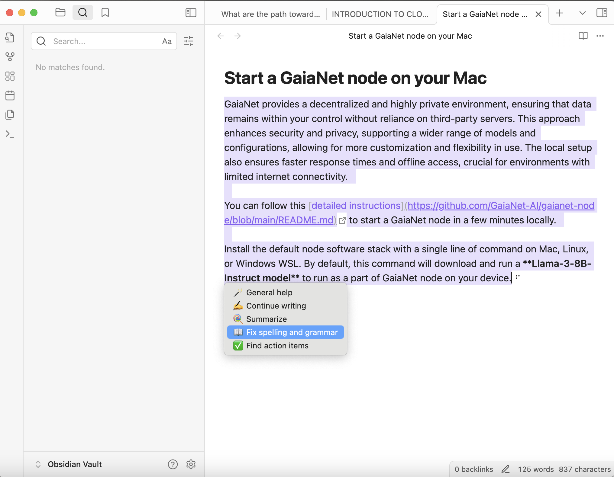

# Obsidian

Obsidian is a note-taking application that enables users to create, link, and visualize ideas directly on their devices. With Obsidian, you can seamlessly sync notes across devices, publish your work, and collaborate with others. The app is highly customizable, allowing users to enhance functionality through a wide range of plugins and themes. Its unique features include a graph view to visualize connections between notes, making it ideal for managing complex information and fostering creativity. Obsidian also emphasizes data privacy by storing notes locally.

**Obsidian-local-gpt is a plugin that** allows users to run a local large language model within Obsidian note-taking application. This plugin enables various AI-powered features directly in Obsidian, such as text generation, summarization, spelling and grammar checks, and task extraction. 

A key feature of this plugin is that it supports a large number of open source LLMs. You can choose an LLM that is finetuned for your specific task — eg if you take a lot of coding notes, you could choose a Codestral or CodeLlama or DeepSeek LLM. Furthermore, if you choose to run the LLM locally on your own computer, the plugin would support private and offline use of the LLM features. For more details, you can visit the [obsidian-local-gpt GitHub page](https://github.com/pfrankov/obsidian-local-gpt).

This guide explains how to set up and use the plugin with a GaiaNet node as an alternative to OpenAI or Ollama.

## Prerequisites

You will need a Gaia node ready to provide LLM services through a public URL. You can

* [run your own node](../../node-guide/quick-start.md)
* [use a public node](../nodes.md)

In this tutorial, we will use a public node.

| Attribute | Value |
|-----|--------|
| API endpoint URL | https://llama-3-8b.us.gaianet.network/v1 |
| Model Name | Meta-Llama-3-8B-Instruct-Q5_K_M |

## Obsidian-local-gpt Plugin Setup

Make sure you have already installed the Obsidian app on your device.

### Install the Obsidian-local-gpt Plugin

* Open Obsidian settings, navigate to "Community plugins", and search for `obsidian-local-gpt`.
* Install the plugin by clicking “Install”.

Then click “Enable”.

### **Configure the Plugin**

1. Go to the plugin settings.
2. Select "AI Provider" as "OpenAI compatible server".
3. Set the server URL. Use https://llama-3-8b.us.gaianet.network/ if you are using a public GaiaNet node. Or, use http://localhost:8080/ if you are running a local GaiaNet node. 
4. Configure API key to GaiaNet

Make sure to click the refresh button and choose the **Meta-Llama-3-8B-Instruct.Q5_K_M **model if you’re using the public GaiaNet node url and **Phi-3-mini-4k-instruct** if you’re using the local GaiaNet node.

### Configure Obsidian Hotkey 

1. Open Obsidian Settings
2. Go to Hotkeys
3. Filter "Local" and you should see "Local GPT: Show context menu"
4. Click on `+` icon and press hotkey (e.g. `⌘ + M`)

As long as you have set the hotkey, while writing or editing a note, select the text you want to interact with, and press the hotkey you have set to use this LLM powered plugin!

## Use Cases

### **Text Continuation**

* Select a text segment, right-click, and choose "Continue writing". The model will generate the continuation (dislayed in the screenshot in grey).

### **Summarization**

* Select a longer text segment, right-click, and choose "Summarize text". The model provides a summary as below of the CNAI report content I seleted.

Here is a concise summary of the key points:

* Cloud Native (CN) refers to well-balanced systems built using microservices, promoting modular design and reusability.
* Kubernetes has become the de facto cloud operating system, offering scalability, resilience, and DevOps best practices.
* Every Cloud Service Provider offers Kubernetes as a service, facilitating access to infrastructure and support services for various workloads, including AI/ML.
* The Cloud Native Computing Foundation defines Cloud Native as empowering organizations to build scalable applications in modern environments using containers, microservices, and declarative APIs.
* Cloud Native Artificial Intelligence (CNAI) is an evolving extension of Cloud Native, focusing on building and deploying AI applications and workloads using Cloud Native principles.

### **Spelling and Grammar Check**

* Select text, right-click, and choose "Fix spelling and grammar". The model will correct errors.

### **Extract Action Items**

* For notes with multiple tasks, select the text and click "Find action items". The model will list the tasks.

The Generated content are displayed below your own text:

`Here are the action items extracted from the document in Markdown checkbox format:`

* `[ ] Add feedback on WasmEdge Q3 Roadmap Discussion`
* `[ ] Provide input on Update on WasmEdge Community Governance`
* `[ ] Discuss any additional topics at the meeting (add to [https://docs.google.com/document/d/1iFlVl7R97Lze4RDykzElJGDjjWYDlkI8Rhf8g4dQ5Rk/edit#](https://docs.google.com/document/d/1iFlVl7R97Lze4RDykzElJGDjjWYDlkI8Rhf8g4dQ5Rk/edit))`

`Let me know if you'd like me to help with anything else!`

### **General Assistance**

* Select any text and click "General help" to get contextually relevant information from the model.

I entered and selected some information on KubeCon + CloudNativeCon + Open Source Summit + AI_dev China 2024.
Because llama3 has not been trained with info on this conference, so the output is not very helpful: 

`The information you're looking for is not present in this context.`

`If you need to know the format and dates of KubeCon + CloudNativeCon + Open Source Summit + AI_dev China 2024, I suggest searching for official announcements or websites related to these events.`

## Try it now!

Ready to supercharge your note-taking with AI? Get started with the Obsidian-local-gpt plugin and GaiaNet today:

1. Set up the Obsidian-local-gpt plugin in your Obsidian app.
2. Explore the various AI-powered features to enhance your productivity.

Start your journey towards smarter, more efficient note-taking now!
