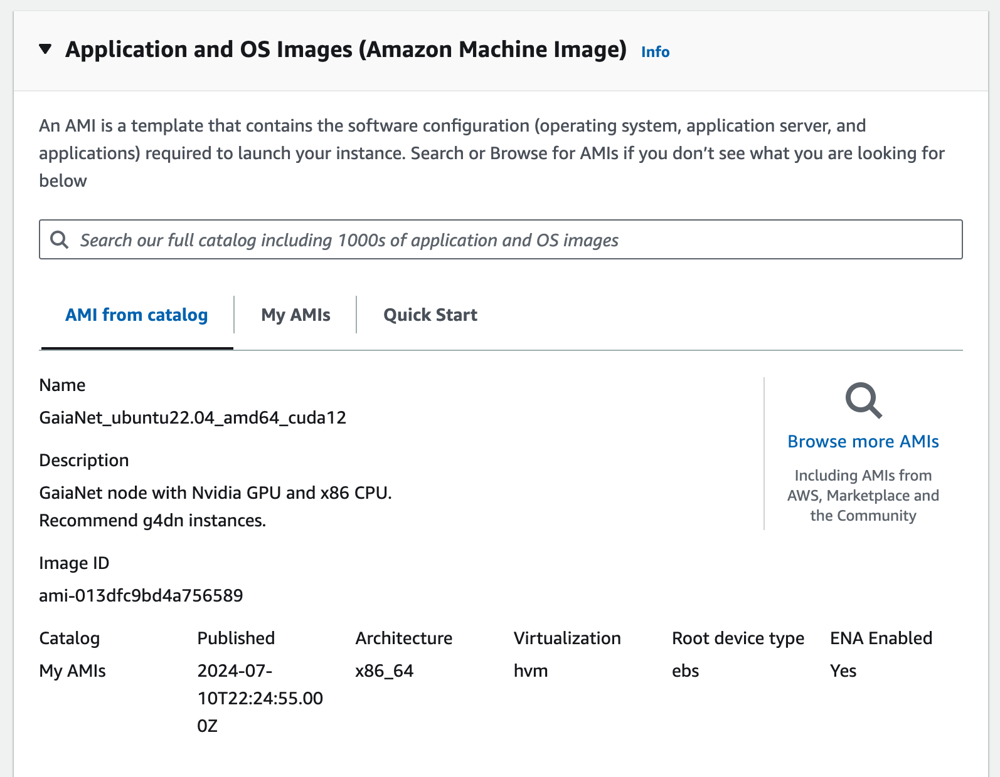
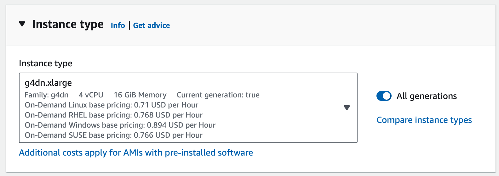
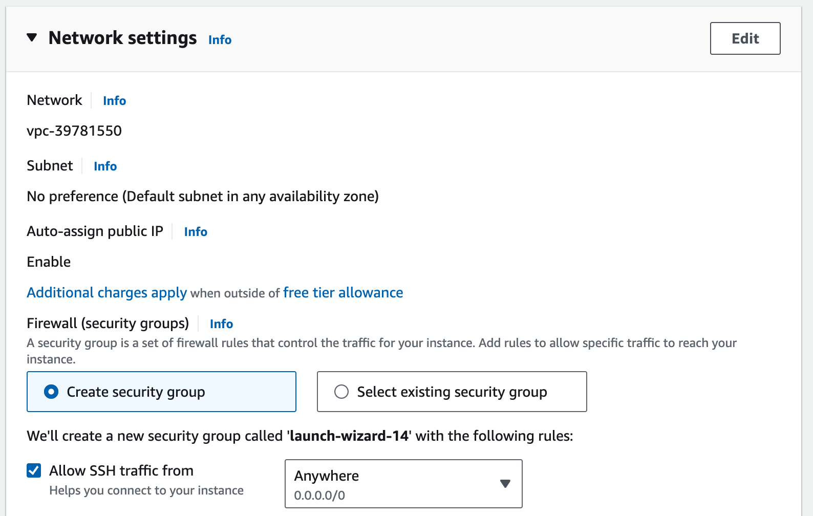

# Start a node on AWS using AMI images

We have created a series of public AMIs for you to start GaiaNet nodes in AWS with just a few clicks.

Now we have three AMI images available in the Asia Pacific (Osaka) and all the US regions including N. Virginia, Ohio, N. California, and Oregon.

| AMI Images Name                  | Architecture                                                                                                                  | Regions                                                 |
|----------------------------------|-------------------------------------------------------------------------------------------------------------------------------|---------------------------------------------------------|
| GaiaNet_ubuntu22.04_amd64_cuda12 | GPU                                                                                                                           | N. Virginia, Ohio, N. California, Oregon, and Osaka |
| GaiaNet_ubuntu22.04_amd64        | x86 CPU machines                                                                                                              | N. Virginia, Ohio, N. California, Oregon, and Osaka |
| GaiaNet_ubuntu22.04_arm64        | ARM CPU machines                                                                                                              | N. Virginia, Ohio, N. California, Oregon, and Osaka |


## Running an Nvidia GPU-enabled AWS instance

Load the [AWS console](https://aws.amazon.com/console/) and sign into your account. Go to EC2 | instances and 
click on the "Launch instance" button.

In the "Application and OS Images" section, search the AMI catalog and select the image named `GaiaNet_ubuntu22.04_amd64_cuda12`.



In the "Instance type" section, select any of the `g4dn` types. Those are EC2 VMs with Nvidia T4 GPUs.



In the "Network settings", make sure that you allow SSH connections.



Click on the "Launch instance" button and wait for the instance to start up. Once the instance is ready, SSH
into its public IP address. Once you are in the VM, run the following two commands.

```
gaianet init
gaianet start
```

The node is ready when it shows `The GaiaNet node is started at: https://...` on the console.
You can go to that URL from your browser to interact with the GaiaNet node.

You can [customize your GaiaNet node](../customize.md) with your own choice of LLMs and knowledge base snapshots.

## Running a CPU-only AWS instance

Load the [AWS console](https://aws.amazon.com/console/) and sign into your account. Go to EC2 | instances and 
click on the "Launch instance" button.

In the "Application and OS Images" section, search the AMI catalog and select the image named 

* `GaiaNet_ubuntu22.04_amd64` for x86 CPU machines
* `GaiaNet_ubuntu22.04_arm64` for ARM CPU machines

In the "Instance type" section, select an instance with at least 8GB of RAM. For example, we recommend `t2.large` or `t2.xlarge` instances.

In the "Network settings", make sure that you allow SSH connections.

Click on the "Launch instance" button and wait for the instance to start up. Once the instance is ready, SSH
into its public IP address. Once you are in the VM, run the following two commands.

```
gaianet init
gaianet start
```

The node is ready when it shows `The GaiaNet node is started at: https://...` on the console.
You can go to that URL from your browser to interact with the GaiaNet node.

You can [customize your GaiaNet node](../customize.md) with your own choice of LLMs and knowledge base snapshots.

Good luck!

