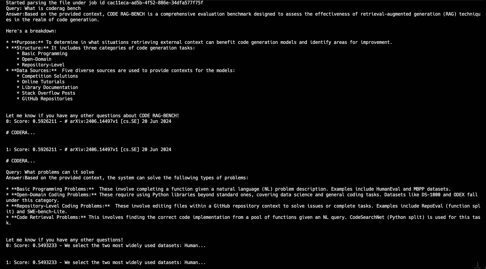

# LlamaCloud

LlamaParse is an API created by LlamaIndex to efficiently parse and represent files for efficient retrieval and context augmentation using LlamaIndex frameworks. LlamaParse can support different kinds of files, like pdf, doc, .ppt, and other formats.

You can configure LlamaParse to use the GaiaNet node as the LLM backend, hence you can create a RAG application based on your PDF files locally.

## Prerequisites

You will need a Gaia node ready to provide LLM services through a public URL. You can

* [run your own node](../../node-guide/quick-start.md)
* [use a public node](../nodes.md)

In this tutorial, we will use public nodes to power the Continue plugin.

| Model type | API base URL | Model name |
|-----|--------|-----|
| Chat | https://gemma.us.gaianet.network/v1 | gemma |
| Embedding | https://gemma.us.gaianet.network/v1 | nomic-embed |

## Steps

We will use an open-sourced GitHub repo, called `llamaparse-integration`,  to make LlamaPase easy to use.  The `llamaparse-integration` application supports

* Multiple file formats, like `.pdf` and `.doc`,
* Multiple files

We will need to get the source code in your terminal first. 

```
git clone https://github.com/alabulei1/llamaparse-integration.git
cd llamaparse-integration
```

Next, install the required mode packages.

```
npm install llamaindex
npm install dotenv
```

Start a Qdrant instance. The Qdrant instance is to store the embeddings.

```
mkdir qdrant_storage
mkdir qdrant_snapshots

nohup docker run -d -p 6333:6333 -p 6334:6334 \
    -v $(pwd)/qdrant_storage:/qdrant/storage:z \
    -v $(pwd)/qdrant_snapshots:/qdrant/snapshots:z \
    qdrant/qdrant
```

Then, we will need to set up the LLM  model settings. We can configure the model setting in the `.env` file. 

```
OPENAI_BASE_URL=https://gemma.us.gaianet.network/v1/
OPENAI_API_KEY=gaianet
LLAMAEDGE_CHAT_MODEL=gemma
LLAMAEDGE_EMBEDDING_MODEL=nomic
LLAMA_CLOUD_API_KEY=Your_Own_KEY
FILE_PATH=
FILE_DIR=./pdf_dir
COLLECTION_NAME=default
QDRANT_URL=http://127.0.0.1:6333
SAVE_MARKDOWN_PATH=output.md
```

Here are some notes about the `.env` setting:

* You can get the LlamaCloud key from https://cloud.llamaindex.ai
* You may need to make changes according to your model setting and file path.
* If you put your file name in the `FILE_PATH=`, the program will build a RAG application with this single pdf file.
* If the `FILE_PATH=` is empty, the program will build a RAG application with the files under the `FILE_DIR=./pdf_dir`. You can include multiple files in the folder. 

Next, we can run the program to build an RAG application based on the PDF file

```
npx tsx pdfRender.ts
```

After it runs successfully, you can send a query via the command line.



