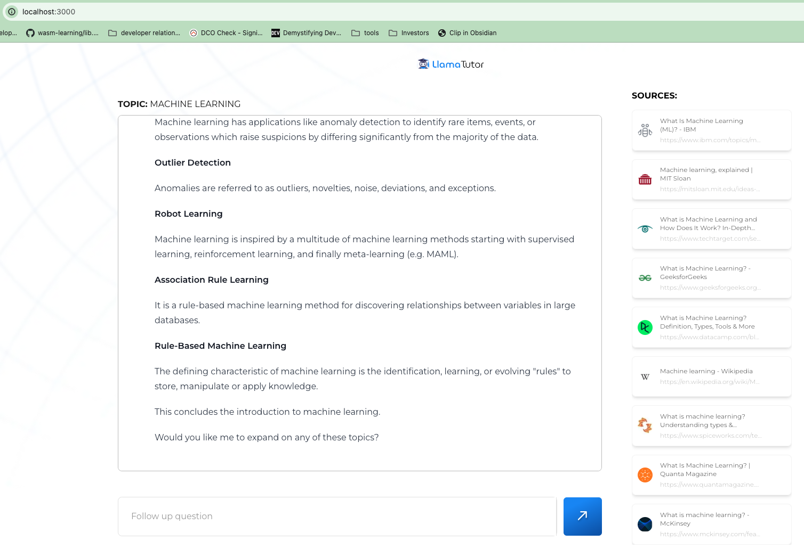

# LlamaTutor

The [LlamaTutor](https://github.com/Nutlope/llamatutor) is a TypeScript
application using Llama 3.1 to act as an open-source AI personal tutor. When you run it, it will ask the LLM
to search on the web based on your inquiry topic and then generate content for you to learn.

The program didn't use the official OpenAI library, we can use the forked one that supports [using a Gaia node](intro.md) as the LLM backend.

## Prerequisites

You will need a Gaia node ready to provide LLM services through a public URL. You can

* [Run your own node](../../node-guide/quick-start.md)
* [Use a public node](../nodes.md)

In this tutorial, we will use a public Llama3 node.

| Attribute | Value |
|-----|--------|
| API endpoint URL | https://llama8b.gaia.domains/v1 |
| Model Name | llama |
| API KEY | gaia |

> If you're using a Domain service, not your own node, you will [need to get an API key from Gaia](../getting-started/authentication.md).

## Run the agent

First, we will need to get the source code of the forked LlamaTutor

```
git clone https://github.com/JYC0413/llamatutor.git
cd llamatutor
```

Next, configure the `.env` file.

```
cp .example.env .env
```

You will need to configure four parameters here.

* SERPER_API_KEY: The [serper API key](https://serper.dev/) for searching content online. You can also use BING_API_KEY here.
* LLAMAEDGE_BASE_URL: URL for the LLM API base URL.
* LLAMAEDGE_MODEL_NAME: Name of the model to be used.
* LLAMAEDGE_API_KEY: API key for accessing the LLM services.

Then, we will need to install the required dependencies.

```
npm install
```

Next, let's run the application locally.

```
npm run dev
```

Finally, open http://localhost:3000 in your browser and start to learn.


